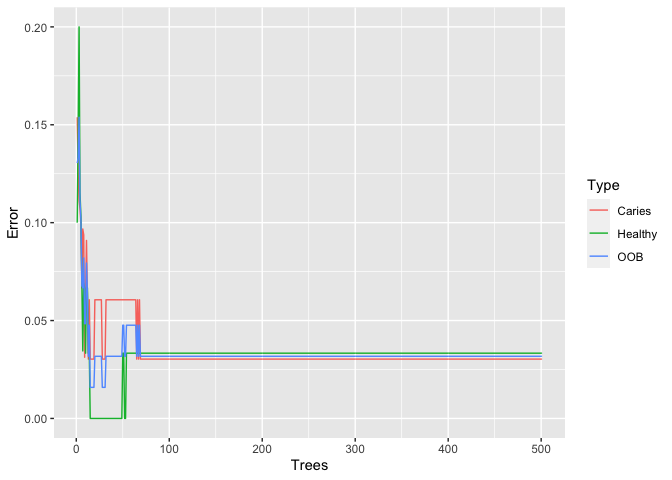

<br>

Often in Microbiome studies we visualize high dimensional data using techniques such as NMDS ordination. These ordination methods are a great way to 'see' how two groups of data, for example samples from healthy and disease subjects, are different from each other in terms of their overall microbial profile. The next question then is what are some of the most important features, or species, that drive the difference between the 2 groups in question. Answering that question will help us identify specific bacteria that might be the drivers of dysbiosis. As such these key species can be considered 'biomarkers' for dysbiosis, and can eventually become target for preventative or therapeutic interventions.

Here I have described an approach for identifying key biomarkers involved in oral microbiota dysbiosis associated with development of dental caries. The dataset used is amplicon sequencing (16S V1-V3) of healthy children's supragingival plaque (tooth surface biofilm) and severe early childhood caries (SECC) affected children's tooth cavity (dentin) samples.

I have applied the Machine Learning method 'Random Forest' to model the high dimensional species counts data, and used the information to produce a list of most important species. 

<br>

Load required R packages


```r
library(randomForest)
library(plyr) # for the "arrange" function
library(rfUtilities) # to test model significance
library(caret) # to get leave-one-out cross-validation accuracies and also contains the nearZeroVar function
library(e1071)
library(ggplot2)
library(vegan)
```

<br>

Load otu table and relevant metadata 

```r
otu_table <- readRDS("data/v13_counts_hd.rds")
metadata <- readRDS("data/meta_hd.rds")
```


Convert to Relative Abundance & Compute NMDS

```r
# Convert to relative abundance
otu_table_pct <- decostand(otu_table, method = "total")

# Compute NMDS
set.seed(12345); capture.output(otu_table_pct.mds <- metaMDS(otu_table_pct, trymax = 200, autotransform = F, wascores = F))
```

```
##  [1] "Run 0 stress 0.1615013 "                                   
##  [2] "Run 1 stress 0.1752697 "                                   
##  [3] "Run 2 stress 0.1762489 "                                   
##  [4] "Run 3 stress 0.1712599 "                                   
##  [5] "Run 4 stress 0.1852062 "                                   
##  [6] "Run 5 stress 0.1595602 "                                   
##  [7] "... New best solution"                                     
##  [8] "... Procrustes: rmse 0.01360326  max resid 0.09064305 "    
##  [9] "Run 6 stress 0.175861 "                                    
## [10] "Run 7 stress 0.1776999 "                                   
## [11] "Run 8 stress 0.1683114 "                                   
## [12] "Run 9 stress 0.1838743 "                                   
## [13] "Run 10 stress 0.1595601 "                                  
## [14] "... New best solution"                                     
## [15] "... Procrustes: rmse 6.283206e-05  max resid 0.0003336504 "
## [16] "... Similar to previous best"                              
## [17] "Run 11 stress 0.17126 "                                    
## [18] "Run 12 stress 0.1712599 "                                  
## [19] "Run 13 stress 0.175861 "                                   
## [20] "Run 14 stress 0.1653857 "                                  
## [21] "Run 15 stress 0.1595599 "                                  
## [22] "... New best solution"                                     
## [23] "... Procrustes: rmse 0.0001376993  max resid 0.000762226 " 
## [24] "... Similar to previous best"                              
## [25] "Run 16 stress 0.1743003 "                                  
## [26] "Run 17 stress 0.1651325 "                                  
## [27] "Run 18 stress 0.1775863 "                                  
## [28] "Run 19 stress 0.1842786 "                                  
## [29] "Run 20 stress 0.168316 "                                   
## [30] "*** Solution reached"
```

```r
# Permanova
set.seed(12345); otu_table_pct.perm <- adonis(formula = otu_table_pct ~ metadata$status) # R2 0.25679, p < 0.001***

# Making dataframe for plotting
otu_table_pct.mds.df <- data.frame(scores(otu_table_pct.mds, display = 'sites'))
otu_table_pct.mds.df$status <- metadata$status[match(row.names(otu_table_pct.mds.df), row.names(metadata))]
```

<br>

Plot NMDS

```r
ggplot(otu_table_pct.mds.df, aes(x=NMDS1, y=NMDS2)) + stat_ellipse(alpha=0.8, aes(color=status), show.legend = F, lwd=0.2) + 
  geom_point(alpha=0.9, aes(fill = status), size=3, color="black", pch=21, stroke=0.2) + scale_fill_manual(values=c("firebrick4", "forestgreen")) + scale_color_manual(values=c("firebrick4", "forestgreen")) + 
  labs(title = "Beta Diversity Comparison", subtitle = "Relative Abundance", fill="Subject status") +
  geom_text(aes(label=rownames(otu_table_pct.mds.df)), size=2) + 
  annotate("text", x = (min(otu_table_pct.mds.df$NMDS1) + max(otu_table_pct.mds.df$NMDS1))/2, y = max(otu_table_pct.mds.df$NMDS2)+0.1, 
           label = paste("p <", otu_table_pct.perm$aov.tab$`Pr(>F)`[1], "(PERMANOVA)", sep=" ")) + theme_classic() +
  theme(plot.title = element_text(size=15, face="bold", hjust=0.5), plot.subtitle = element_text(size=10, hjust=0.5), 
        axis.title = element_text(size=10, face="bold"), axis.text = element_text(size=8, face="bold"), legend.position="bottom", 
        axis.line = element_line(size = 0.3),legend.title = element_text(size=13, face="bold"), legend.text = element_text(size = 11))
```

<!-- -->

```r
ggsave(file = "figs/otu_table_pct_mds.pdf", width = 10, height = 6, units = "in")
```

<br>

Removing EG_204_d as an outlier

```r
otu_table_filt <- otu_table[row.names(otu_table) != "EG_204_d", ]
dim(otu_table_filt)
```

```
## [1]  63 343
```

```r
metadata_filt <- metadata[row.names(metadata) != "EG_204_d", ]
```

<br>

Convert to Relative Abundance & Compute NMDS

```r
otu_table_filt_pct <- decostand(otu_table_filt, method = "total")

# Compute NMDS
set.seed(12345); capture.output(otu_table_filt_pct.mds <- metaMDS(otu_table_filt_pct, trymax = 200, autotransform = F, wascores = F))
```

```
##  [1] "Run 0 stress 0.1620469 "                                  
##  [2] "Run 1 stress 0.1719681 "                                  
##  [3] "Run 2 stress 0.1757759 "                                  
##  [4] "Run 3 stress 0.1620485 "                                  
##  [5] "... Procrustes: rmse 0.0009176221  max resid 0.005475511 "
##  [6] "... Similar to previous best"                             
##  [7] "Run 4 stress 0.1706512 "                                  
##  [8] "Run 5 stress 0.1825911 "                                  
##  [9] "Run 6 stress 0.1656029 "                                  
## [10] "Run 7 stress 0.1599836 "                                  
## [11] "... New best solution"                                    
## [12] "... Procrustes: rmse 0.01396524  max resid 0.09188508 "   
## [13] "Run 8 stress 0.1825837 "                                  
## [14] "Run 9 stress 0.1599809 "                                  
## [15] "... New best solution"                                    
## [16] "... Procrustes: rmse 0.0007367411  max resid 0.004403431 "
## [17] "... Similar to previous best"                             
## [18] "Run 10 stress 0.1803477 "                                 
## [19] "Run 11 stress 0.1763276 "                                 
## [20] "Run 12 stress 0.181909 "                                  
## [21] "Run 13 stress 0.1706555 "                                 
## [22] "Run 14 stress 0.1772134 "                                 
## [23] "Run 15 stress 0.1709101 "                                 
## [24] "Run 16 stress 0.1721943 "                                 
## [25] "Run 17 stress 0.1599826 "                                 
## [26] "... Procrustes: rmse 0.0004955042  max resid 0.002969735 "
## [27] "... Similar to previous best"                             
## [28] "Run 18 stress 0.1706785 "                                 
## [29] "Run 19 stress 0.1631956 "                                 
## [30] "Run 20 stress 0.1599824 "                                 
## [31] "... Procrustes: rmse 0.000443683  max resid 0.002661857 " 
## [32] "... Similar to previous best"                             
## [33] "*** Solution reached"
```

```r
# Permanova
set.seed(12345); otu_table_filt_pct.perm <- adonis(formula = otu_table_filt_pct ~ metadata_filt$status) # R2 0.25679, p < 0.001***
otu_table_filt_pct.perm # R2: 0.27237, p < 0.001 ***
```

```
## 
## Call:
## adonis(formula = otu_table_filt_pct ~ metadata_filt$status) 
## 
## Permutation: free
## Number of permutations: 999
## 
## Terms added sequentially (first to last)
## 
##                      Df SumsOfSqs MeanSqs F.Model      R2 Pr(>F)    
## metadata_filt$status  1    5.1181  5.1181  22.834 0.27237  0.001 ***
## Residuals            61   13.6731  0.2241         0.72763           
## Total                62   18.7913                 1.00000           
## ---
## Signif. codes:  0 '***' 0.001 '**' 0.01 '*' 0.05 '.' 0.1 ' ' 1
```

```r
# Making dataframe for plotting
otu_table_filt_pct.mds.df <- data.frame(scores(otu_table_filt_pct.mds, display = 'sites'))
otu_table_filt_pct.mds.df$status <- metadata_filt$status[match(row.names(otu_table_filt_pct.mds.df), row.names(metadata_filt))]
```
<br>

Plot NMDS

```r
ggplot(otu_table_filt_pct.mds.df, aes(x=NMDS1, y=NMDS2)) + stat_ellipse(alpha=0.8, aes(color=status), show.legend = F, lwd=0.2) + 
  geom_point(alpha=0.9, aes(fill = status), size=3, color="black", pch=21, stroke=0.2) + scale_fill_manual(values=c("firebrick4", "forestgreen")) +
  scale_color_manual(values=c("firebrick4", "forestgreen")) + 
  labs(title = "Beta Diversity Comparison", subtitle = "Relative Abundance", fill="Subject status") +
  #geom_text(aes(label=rownames(otu_table_filt_pct.mds.df)), size=3) + 
  annotate("text", x = (min(otu_table_filt_pct.mds.df$NMDS1) + max(otu_table_filt_pct.mds.df$NMDS1))/2, y = max(otu_table_filt_pct.mds.df$NMDS2)+0.1, 
           label = paste("p <", otu_table_filt_pct.perm$aov.tab$`Pr(>F)`[1], "(PERMANOVA)", sep=" ")) + theme_classic() +
  theme(plot.title = element_text(size=15, face="bold", hjust=0.5), plot.subtitle = element_text(size=10, hjust=0.5), 
        axis.title = element_text(size=10, face="bold"), axis.text = element_text(size=8, face="bold"), legend.position="bottom", 
        axis.line = element_line(size = 0.3), legend.title = element_text(size=13, face="bold"), legend.text = element_text(size = 11))
```

<!-- -->

```r
ggsave(file = "figs/otu_table_filt_pct_mds.pdf", width = 10, height = 6, units = "in")
```

<br>

Filter out rare OTUs
Keeping only those OTUs which have less than 30 (75% of total number of samples) times 0 values in the dataset

```r
otu_table_filt_rare_removed <- otu_table_filt[, colSums(otu_table_filt == 0) < 0.75*nrow(otu_table_filt), ]
dim(otu_table_filt_rare_removed) #  [1] 63 x 166 (166 species remain, of the 343)
```

```
## [1]  63 166
```
<br>

Convert to Relative Abundance & Compute NMDS

```r
otu_table_filt_rare_removed_pct <- decostand(otu_table_filt_rare_removed, method = "total")

# Compute NMDS
set.seed(12345); capture.output(otu_table_filt_rare_removed_pct.mds <- metaMDS(otu_table_filt_rare_removed_pct, trymax = 200, autotransform = F, wascores = F))
```

```
##  [1] "Run 0 stress 0.1613939 "                                   
##  [2] "Run 1 stress 0.1587463 "                                   
##  [3] "... New best solution"                                     
##  [4] "... Procrustes: rmse 0.01444061  max resid 0.09399246 "    
##  [5] "Run 2 stress 0.173289 "                                    
##  [6] "Run 3 stress 0.1831555 "                                   
##  [7] "Run 4 stress 0.1694659 "                                   
##  [8] "Run 5 stress 0.1801432 "                                   
##  [9] "Run 6 stress 0.1647693 "                                   
## [10] "Run 7 stress 0.1587683 "                                   
## [11] "... Procrustes: rmse 0.002201546  max resid 0.01411293 "   
## [12] "Run 8 stress 0.1694658 "                                   
## [13] "Run 9 stress 0.1785171 "                                   
## [14] "Run 10 stress 0.170947 "                                   
## [15] "Run 11 stress 0.1749337 "                                  
## [16] "Run 12 stress 0.1795364 "                                  
## [17] "Run 13 stress 0.1785027 "                                  
## [18] "Run 14 stress 0.1695509 "                                  
## [19] "Run 15 stress 0.1613831 "                                  
## [20] "Run 16 stress 0.1709469 "                                  
## [21] "Run 17 stress 0.1587465 "                                  
## [22] "... Procrustes: rmse 6.223779e-05  max resid 0.0002525714 "
## [23] "... Similar to previous best"                              
## [24] "Run 18 stress 0.1787676 "                                  
## [25] "Run 19 stress 0.1694479 "                                  
## [26] "Run 20 stress 0.1732901 "                                  
## [27] "*** Solution reached"
```

```r
# Permanova
set.seed(12345); otu_table_filt_rare_removed_pct.perm <- adonis(formula = otu_table_filt_rare_removed_pct ~ metadata_filt$status) # R2 0.25679, p < 0.001***
otu_table_filt_rare_removed_pct.perm # R2: 0.28585, p < 0.001 ***
```

```
## 
## Call:
## adonis(formula = otu_table_filt_rare_removed_pct ~ metadata_filt$status) 
## 
## Permutation: free
## Number of permutations: 999
## 
## Terms added sequentially (first to last)
## 
##                      Df SumsOfSqs MeanSqs F.Model      R2 Pr(>F)    
## metadata_filt$status  1    5.1982  5.1982  24.416 0.28585  0.001 ***
## Residuals            61   12.9871  0.2129         0.71415           
## Total                62   18.1853                 1.00000           
## ---
## Signif. codes:  0 '***' 0.001 '**' 0.01 '*' 0.05 '.' 0.1 ' ' 1
```

```r
# Making dataframe for plotting
otu_table_filt_rare_removed_pct.mds.df <- data.frame(scores(otu_table_filt_rare_removed_pct.mds, display = 'sites'))
otu_table_filt_rare_removed_pct.mds.df$status <- metadata_filt$status[match(row.names(otu_table_filt_rare_removed_pct.mds.df), row.names(metadata_filt))]
```
<br>

Plot NMDS

```r
ggplot(otu_table_filt_rare_removed_pct.mds.df, aes(x=NMDS1, y=NMDS2)) + stat_ellipse(alpha=0.8, aes(color=status), show.legend = F, lwd=0.2) + 
  geom_point(alpha=0.9, aes(fill = status), size=3, color="black", pch=21, stroke=0.2) + scale_fill_manual(values=c("firebrick4", "forestgreen")) +
  scale_color_manual(values=c("firebrick4", "forestgreen")) + 
  #geom_text(aes(label=rownames(otu_table_filt_rare_removed_pct.mds.df)), size=3) + 
  annotate("text", x = (min(otu_table_filt_rare_removed_pct.mds.df$NMDS1) + max(otu_table_filt_rare_removed_pct.mds.df$NMDS1))/2, 
           y = max(otu_table_filt_rare_removed_pct.mds.df$NMDS2)+0.1, 
           label = paste("p <", otu_table_filt_rare_removed_pct.perm$aov.tab$`Pr(>F)`[1], "(PERMANOVA)", sep=" ")) + theme_classic() +
  labs(title = "Beta Diversity Comparison", subtitle = "Relative Abundance", fill="Subject status") +
  theme(plot.title = element_text(size=15, face="bold", hjust=0.5), plot.subtitle = element_text(size=10, hjust=0.5), 
        axis.title = element_text(size=10, face="bold"), axis.text = element_text(size=8, face="bold"), legend.position="bottom", 
        axis.line = element_line(size = 0.3), legend.title = element_text(size=13, face="bold"), legend.text = element_text(size = 11))
```

<!-- -->

```r
ggsave(file = "figs/otu_table_filt_rare_removed_pct_mds.pdf", width = 10, height = 6, units = "in")
```

<br>

Build Random Forest Model & inspect confusion matrix

```r
set.seed(123); RF_status_classify <- randomForest(x=otu_table_filt_rare_removed_pct, y=metadata_filt$status,
                                                 ntree=501, importance=TRUE, proximities=TRUE )
RF_status_classify
```

```
## 
## Call:
##  randomForest(x = otu_table_filt_rare_removed_pct, y = metadata_filt$status,      ntree = 501, importance = TRUE, proximities = TRUE) 
##                Type of random forest: classification
##                      Number of trees: 501
## No. of variables tried at each split: 12
## 
##         OOB estimate of  error rate: 3.17%
## Confusion matrix:
##         Caries Healthy class.error
## Caries      32       1  0.03030303
## Healthy      1      29  0.03333333
```

<br>

Plot Out Of Bag (OOB) error rate

```r
oob.error.data <- data.frame(
  Trees=rep(1:nrow(RF_status_classify$err.rate), times=3),
  Type=rep(c("OOB", "Caries", "Healthy"), each=nrow(RF_status_classify$err.rate)),
  Error=c(RF_status_classify$err.rate[,"OOB"], 
    RF_status_classify$err.rate[,"Caries"], 
    RF_status_classify$err.rate[,"Healthy"]))

ggplot(data=oob.error.data, aes(x=Trees, y=Error)) + geom_line(aes(color=Type))
```

<!-- -->

```r
# ggsave("oob_error_rate_500_trees.pdf")
```

<br>

Permutation Testing Model Performance

```r
#Evaluate is set to false to reduce Knit time
RF_status_classify_sig <- rf.significance( x=RF_status_classify, xdata=otu_table_filt_rare_removed_pct,
                                          nperm=1000 , ntree=501 )
RF_status_classify_sig
```

<br>

Accuracy Estimated by Cross-validation

```r
fit_control <- trainControl(method = "LOOCV")    
RF_status_classify_loocv <- train(x=otu_table_filt_rare_removed_pct, y=metadata_filt$status,
                                  method="rf", ntree=501 , tuneGrid=data.frame(mtry=25), trControl=fit_control)
RF_status_classify_loocv
```

```
## Random Forest 
## 
##  63 samples
## 166 predictors
##   2 classes: 'Caries', 'Healthy' 
## 
## No pre-processing
## Resampling: Leave-One-Out Cross-Validation 
## Summary of sample sizes: 62, 62, 62, 62, 62, 62, ... 
## Resampling results:
## 
##   Accuracy  Kappa    
##   0.968254  0.9363636
## 
## Tuning parameter 'mtry' was held constant at a value of 25
```

<br>

Identifying Important Features

```r
RF_status_classify_imp <- as.data.frame(RF_status_classify$importance)
RF_status_classify_imp$features <- rownames(RF_status_classify_imp)
RF_status_classify_imp_25 <- RF_status_classify_imp[order(RF_status_classify_imp$MeanDecreaseAccuracy, decreasing = TRUE), ][c(1:25), ]
```
MeanDecreaseAccuracy: Measure of the extent to which a variable improves the accuracy of the forest in predicting the classification. Higher values mean that the variable improves prediction. In a rough sense, it can be interpreted as showing the amount of increase in classification accuracy that is provided by including the variable in the model

<br>

Inspect most important features (species)

```r
ggplot(RF_status_classify_imp_25[c(1:25), ], aes(x = reorder(features, -MeanDecreaseAccuracy), MeanDecreaseAccuracy)) + geom_bar(stat="identity") +
  labs(title = "Most Important Features (Species)", subtitle = "Mean Decrease in Accuracy", x="") + theme_classic() +
  theme(plot.title = element_text(size=15, face="bold", vjust=0, hjust=0.5), plot.subtitle = element_text(size=10, hjust=0.5),
        axis.title = element_text(size=12, face="bold"), 
        axis.text.x = element_text(size=9, face="bold", colour = "black", angle=90, hjust=1, vjust=0.5),
        axis.text.y = element_text(size=8, face="bold"), legend.position="bottom", 
        axis.line = element_line(size = 0.3), legend.title = element_text(size=13, face="bold"), legend.text = element_text(size = 11))
```

<!-- -->

```r
ggsave(file = "figs/otu_table_filt_rare_removed_pct_imp_accuracy.pdf", width = 10, height = 6, units = "in")

ggplot(RF_status_classify_imp_25[c(1:25), ], aes(x = reorder(features, -MeanDecreaseGini), MeanDecreaseGini)) + geom_bar(stat="identity") +
  labs(title = "Most Important Features (Species)", subtitle = "Mean Decrease in Gini", x="") + theme_classic() +
  theme(plot.title = element_text(size=15, face="bold", vjust=0, hjust=0.5), plot.subtitle = element_text(size=10, hjust=0.5),
        axis.title = element_text(size=12, face="bold"), 
        axis.text.x = element_text(size=9, face="bold", colour = "black", angle=90, hjust=1, vjust=0.5),
        axis.text.y = element_text(size=8, face="bold"), legend.position="bottom", 
        axis.line = element_line(size = 0.3), legend.title = element_text(size=13, face="bold"), legend.text = element_text(size = 11))
```

<!-- -->

```r
ggsave(file = "figs/otu_table_filt_rare_removed_pct_imp_gini.pdf", width = 10, height = 6, units = "in")
```

<br>

How many features (species) have positive Mean Decrease Accuracy?

```r
length(which(RF_status_classify_imp$MeanDecreaseAccuracy > 0))
```

```
## [1] 123
```

```r
important_features <- RF_status_classify_imp$features[RF_status_classify_imp$MeanDecreaseAccuracy > 0]
```

<br>

Remove important features 
 

```r
# Filter out important features
otu_table_filt_rare_removed_imp_removed <- otu_table_filt_rare_removed[, !(colnames(otu_table_filt_rare_removed) %in% important_features)]
ncol(otu_table_filt_rare_removed) - ncol(otu_table_filt_rare_removed_imp_removed) # 123 features removed
```

```
## [1] 123
```

```r
# Compute rel. abundances
otu_table_filt_rare_removed_imp_removed_pct <- decostand(otu_table_filt_rare_removed_imp_removed, method="total")

# Compute NMDS
set.seed(12345); capture.output(otu_table_filt_rare_removed_imp_removed_pct.mds <- metaMDS(otu_table_filt_rare_removed_imp_removed_pct, trymax = 200, autotransform = F, wascores = F))
```

```
##  [1] "Run 0 stress 0.1709504 "                                   
##  [2] "Run 1 stress 0.1904594 "                                   
##  [3] "Run 2 stress 0.1834458 "                                   
##  [4] "Run 3 stress 0.1538428 "                                   
##  [5] "... New best solution"                                     
##  [6] "... Procrustes: rmse 0.05324032  max resid 0.3122938 "     
##  [7] "Run 4 stress 0.1835093 "                                   
##  [8] "Run 5 stress 0.1538427 "                                   
##  [9] "... New best solution"                                     
## [10] "... Procrustes: rmse 2.512646e-05  max resid 0.0001448453 "
## [11] "... Similar to previous best"                              
## [12] "Run 6 stress 0.1782886 "                                   
## [13] "Run 7 stress 0.1544531 "                                   
## [14] "Run 8 stress 0.1950964 "                                   
## [15] "Run 9 stress 0.2044425 "                                   
## [16] "Run 10 stress 0.1574374 "                                  
## [17] "Run 11 stress 0.2004102 "                                  
## [18] "Run 12 stress 0.1862222 "                                  
## [19] "Run 13 stress 0.1827019 "                                  
## [20] "Run 14 stress 0.1595281 "                                  
## [21] "Run 15 stress 0.1581305 "                                  
## [22] "Run 16 stress 0.174148 "                                   
## [23] "Run 17 stress 0.1651966 "                                  
## [24] "Run 18 stress 0.1701288 "                                  
## [25] "Run 19 stress 0.3084473 "                                  
## [26] "Run 20 stress 0.1671594 "                                  
## [27] "*** Solution reached"
```

```r
# Permanova
set.seed(12345); otu_table_filt_rare_removed_imp_removed_pct.perm <- adonis(formula = otu_table_filt_rare_removed_imp_removed_pct ~ metadata_filt$status) # R2 0.19607, p < 0.001

# Making dataframe for plotting
otu_table_filt_rare_removed_imp_removed_pct.mds.df <- data.frame(scores(otu_table_filt_rare_removed_imp_removed_pct.mds, display = 'sites'))
otu_table_filt_rare_removed_imp_removed_pct.mds.df$status <- metadata_filt$status[match(row.names(otu_table_filt_rare_removed_imp_removed_pct.mds.df), row.names(metadata_filt))]
```
<br>
  
  Plot NMDS

```r
ggplot(otu_table_filt_rare_removed_imp_removed_pct.mds.df, aes(x=NMDS1, y=NMDS2)) + stat_ellipse(alpha=0.8, aes(color=status), show.legend = F, lwd=0.2) + 
  geom_point(alpha=0.9, aes(fill = status), size=3, color="black", pch=21, stroke=0.2) + scale_fill_manual(values=c("firebrick4", "forestgreen")) +
  scale_color_manual(values=c("firebrick4", "forestgreen")) + 
  #geom_text(aes(label=rownames(otu_table_filt_rare_removed_pct.mds.df)), size=3) + 
  annotate("text", x = (min(otu_table_filt_rare_removed_imp_removed_pct.mds.df$NMDS1) + max(otu_table_filt_rare_removed_imp_removed_pct.mds.df$NMDS1))/2, 
           y = max(otu_table_filt_rare_removed_imp_removed_pct.mds.df$NMDS2)+0.1, 
           label = paste("p <", otu_table_filt_rare_removed_imp_removed_pct.perm$aov.tab$`Pr(>F)`[1], "(PERMANOVA)", sep=" ")) + theme_classic() +
  labs(title = "Beta Diversity Comparison", subtitle = "Relative Abundance", fill="Subject status") +
  theme(plot.title = element_text(size=15, face="bold", hjust=0.5), plot.subtitle = element_text(size=10, hjust=0.5), 
        axis.title = element_text(size=10, face="bold"), axis.text = element_text(size=8, face="bold"), legend.position="bottom", 
        axis.line = element_line(size = 0.3), legend.title = element_text(size=13, face="bold"), legend.text = element_text(size = 11))
```

<!-- -->

```r
ggsave(file = "figs/otu_table_filt_rare_removed_imp_removed_pct_mds.pdf", width = 10, height = 6, units = "in")
```
<br>


Thus we see that using RF classification, we are able to identify the most important features (species) that distinguish the 2 groups (health vs disease).
